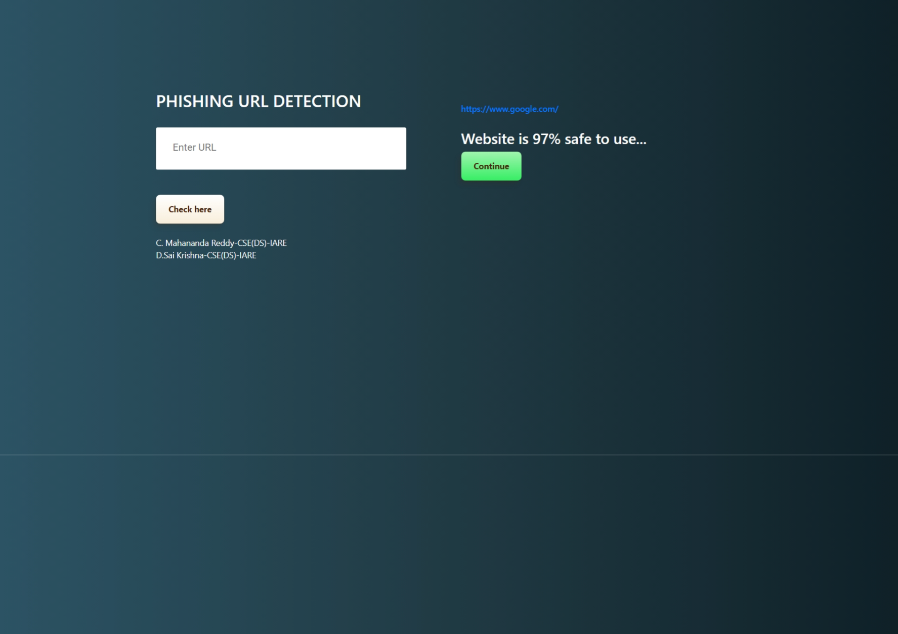
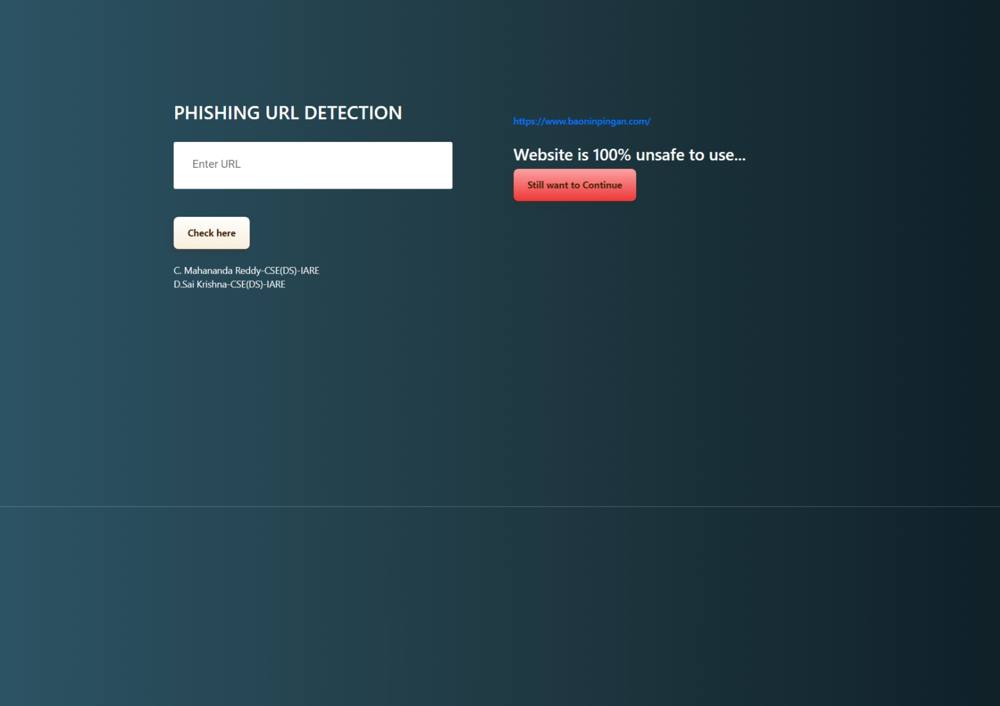

# Phishing URL Detection 




## Introduction
The Internet has now become an integral aspect of our daily lives. However, it has also opened avenues for malicious activities such as Phishing to be carried out anonymously. Phishers employ tactics like social engineering or creating fake websites to trick individuals and organizations into divulging sensitive information like account credentials. Despite numerous attempts to detect phishing websites, phishers continually adapt their strategies to evade detection. One highly effective approach in combating these nefarious activities is through the application of Machine Learning. This is due to the fact that most phishing attacks exhibit certain identifiable patterns which can be discerned using machine learning algorithms. To view the project, click on the link provided.[here]("/").


## Installation
The code is implemented in Python 3.6.10. If you do not have Python installed on your system, you can download it from [here](https://www.python.org/downloads/). If you are currently using an older version of Python, you can upgrade it using the pip package manager, ensuring you have the latest version of pip installed. To install the necessary packages and libraries, execute the following command in the project directory after [cloning](https://www.howtogeek.com/451360/how-to-clone-a-github-repository/) the repository:
```bash
pip install -r requirements.txt
```

## Directory Tree 
```
├── pickle
│   ├── model.pkl
├── static
│   ├── styles.css
├── templates
│   ├── index.html
├── Phishing URL Detection.ipynb
├── Procfile
├── README.md
├── app.py
├── feature.py
├── phishing.csv
├── requirements.txt


```


## Result

Accuracy of various model used for URL detection
<br>

<br>

||ML Model|	Accuracy|  	f1_score|	Recall|	Precision|
|---|---|---|---|---|---|
0|	Gradient Boosting Classifier|	0.974|	0.977|	0.994|	0.986|
1|	CatBoost Classifier|	        0.972|	0.975|	0.994|	0.989|
2|	XGBoost Classifier| 	        0.969|	0.973|	0.993|	0.984|
3|	Multi-layer Perceptron|	        0.969|	0.973|	0.995|	0.981|
4|	Random Forest|	                0.967|	0.971|	0.993|	0.990|
5|	Support Vector Machine|	        0.964|	0.968|	0.980|	0.965|
6|	Decision Tree|      	        0.960|	0.964|	0.991|	0.993|
7|	K-Nearest Neighbors|        	0.956|	0.961|	0.991|	0.989|
8|	Logistic Regression|        	0.934|	0.941|	0.943|	0.927|
9|	Naive Bayes Classifier|     	0.605|	0.454|	0.292|	0.997|


## Conclusion
1. The main takeaway from this project is to explore different machine learning models, conduct Exploratory Data Analysis on the phishing dataset, and comprehend their features.
2. Developing this notebook has significantly enhanced my understanding of the factors influencing the models in determining the safety of URLs. It has also provided insights into the process of tuning models and their impact on model performance.
3. Based on the analysis of the Phishing dataset, it can be concluded that certain features such as "HTTPS," "AnchorURL," and "WebsiteTraffic" play a significant role in distinguishing phishing URLs from legitimate ones.
4. The Gradient Boosting Classifier demonstrates a high accuracy rate of 97.4% in classifying URLs into their respective categories, thus reducing the risk associated with malicious attachments.
